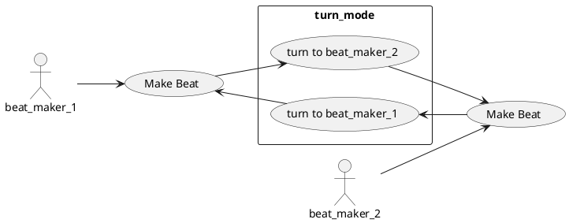

### Turn Mode

```plantuml
@startuml
left to right direction
skinparam packageStyle rectangle
actor beat_maker_1
actor beat_maker_2
"Make Beat" as (mb1)
"Make Beat" as (mb2)
rectangle turn_mode {
  beat_maker_1 --> mb1
  beat_maker_2 --> mb2
  mb1 --> (turn to beat_maker_2)
  (turn to beat_maker_2) --> mb2
  (turn to beat_maker_1) <-- mb2 
  (turn to beat_maker_1) --> mb1
}
@enduml
```

